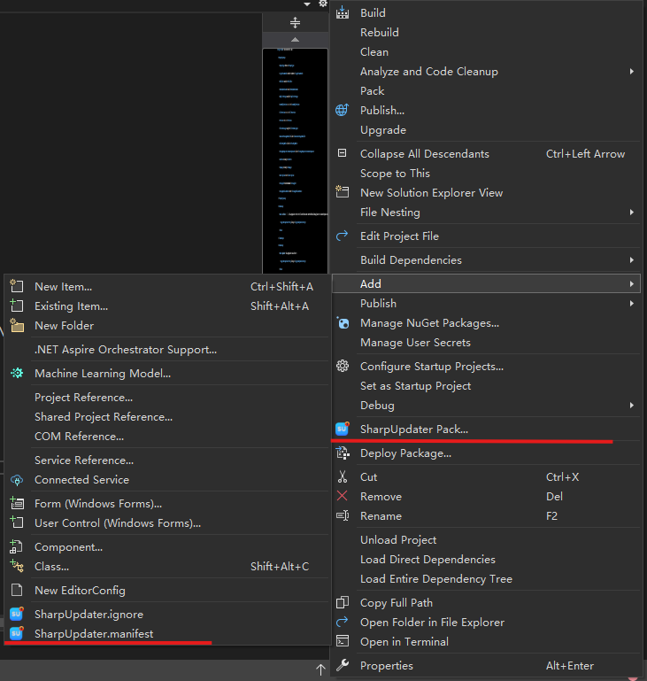

# SharpUpdater VSIX

This is a Visual Studio extension to build/deploy SharpUpdater package (.sp) for your desktop applications.

## Features

- Commands to add ignore files and manifest files.
- Commands to pack and push the SharpUpdater package (.sp) to the server.

## Screenshots

## Fork on GitHub
[https://github.com/cnsharp/SharpUpdater](https://github.com/cnsharp/SharpUpdater)

## Feedback
[https://github.com/cnsharp/SharpUpdater/issues](https://github.com/cnsharp/SharpUpdater/issues)